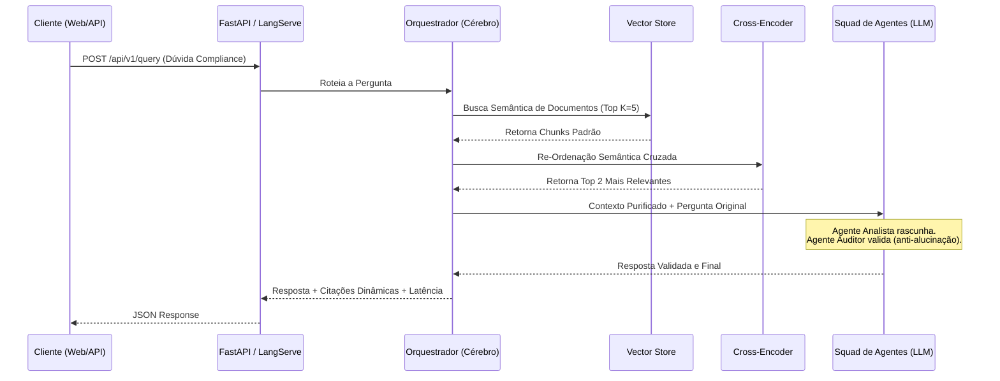

# 🏛️ BACEN Compliance RAG - Multi-Agent AI System


Um sistema avançado de Inteligência Artificial para atuar como **Auditor e Analista de Compliance** com base em normativos do Banco Central do Brasil (BACEN). Projetado com foco em **Clean Code, Arquitetura Hexagonal, MLOps e Observabilidade**, este projeto serve como prova de conceito para desafios avançados de IA.

---

## 🧠 Arquitetura do Sistema

O projeto foi construído seguindo os princípios da **Arquitetura Hexagonal** (Ports & Adapters), garantindo que a regra de negócios fique totalmente isolada das tecnologias externas.

### Fluxo de Execução (RAG)



* **Ingestão e Vetorização (ETL):** `LlamaIndex` + `HuggingFace (all-MiniLM-L6-v2)`. Embeddings gerados localmente, sem custos de API.
* **Banco de Dados Vetorial:** `ChromaDB` - Banco nativo otimizado para recuperação rápida.
* **Re-Ranking Híbrido:** `sentence-transformers` utilizando o Cross-Encoder `ms-marco-MiniLM-L-6-v2` para maximizar a assertividade dos fragmentos de lei passados à IA.
* **Orquestração e Memória:** `LangGraph`, atuando como o cérebro que roteia a query, busca no ChromaDB e chama o Squad de Agentes.
* **Squad Multi-Agente (CrewAI):** Desenvolvido utilizando `CrewAI` (Agente Analista + Agente Auditor de Compliance) para garantir respostas 100% ancoradas na lei (anti-alucinação) e autonomia de delegação.
* **LLM Provider:** `Google Gemini API (gemini-2.5-flash)` via `langchain-google-genai` para inferências de altíssimo desempenho e grande janela de contexto.
* **Camada de Apresentação:** `FastAPI` (REST JSON), `LangServe` (rotas autogeradas e playground RAG) e `Streamlit` para prototipação visual de frontend.
* **Observabilidade:** Instrumentado para `LangFuse` (Tracing avançado).

---

## 📂 Repositório de Conhecimento (RAG Data)

Para que a IA atue estritamente sob as normativas oficiais e evite alucinações (regra fundamental de Compliance), é obrigatório alimentar o "Cérebro" do sistema.

A pasta `data/` na raiz do projeto atua como o seu repositório de conhecimento (*Knowledge Base*).

**Onde encontrar os PDFs oficiais do BACEN?**
- **Busca de Normas (Principal):** [Sistema de Busca de Normas](https://www.bcb.gov.br/estabilidadefinanceira/buscanormas) (Resoluções e Circulares).
- **Regulamento do Pix:** [Portal do Pix no BCB](https://www.bcb.gov.br/estabilidadefinanceira/pix) (Manuais de SLA e MED).

**O que fazer:**
1. Rode o script de automação: `uv run python scripts/scrape_bacen.py` (ou cole seus próprios PDFs baixados na pasta `data/`).
2. Rode o pipeline de Ingestão de Dados (ETL) utilizando `./scripts/ingest.sh`.

O sistema irá automaticamente extrair o texto dos PDFs, particioná-los, transformá-los em embeddings e persistir o conhecimento no banco **ChromaDB**. 

---

## 🚀 Como Executar Localmente

### Pré-requisitos

* Ter o [uv](https://github.com/astral-sh/uv) instalado.
* Obter uma chave da API do **Google Gemini** gratuitamente no [Google AI Studio](https://aistudio.google.com/).

### Passo a Passo

1. **Clone e configure o ambiente**
   Copie o arquivo de variáveis de ambiente e insira sua `GEMINI_API_KEY`:

   ```bash
   cp .env.example .env
   # Edite o .env para colocar sua chave do Google Gemini!
   ```

2. **Ingestão de Dados (Criação do Banco Vetorial ChromaDB)**
   Popule o banco de dados lendo os PDFs da pasta de dados:

   ```bash
   ./scripts/ingest.sh
   ```

3. **Suba a API (FastAPI + LangServe)**
   Em um terminal, suba o motor do backend:
   ```bash
   ./scripts/start.sh
   ```

   Você poderá acessar a interface automática do LangServe em: **[http://localhost:8000/rag/playground](http://localhost:8000/rag/playground)**

4. **Suba o Frontend (Streamlit)**
   Em uma nova aba do terminal, suba o chat interativo em português:
   ```bash
   uv run streamlit run frontend/app_streamlit.py
   ```

### Exemplo de Uso via API

Caso queira testar a integração do RAG via terminal:

```bash
curl -X POST http://localhost:8000/api/v1/query \
     -H "Content-Type: application/json" \
     -d '{"query": "Qual é o prazo máximo para a devolução do Pix via MED?"}'
```

---

## 🐳 Como Executar via Docker (Day-2 Ops)

O projeto está pronto para Cloud (ex: Google Cloud Run). Para subir localmente via contêineres:

```bash
make docker-up
```

---

## ✅ Qualidade e Testes

O projeto contém uma suíte de testes automatizados (`pytest`) validando regras de negócio, infraestrutura de adaptadores e orquestração (LangGraph). **A cobertura de código (Coverage) é superior a 94%**.

Para rodar os testes e gerar o relatório:

```bash
./scripts/test.sh
```

**Testes Funcionais (End-to-End):**
Para rodar um teste completo simulando o fluxo de ponta a ponta chamando a API real do Gemini, utilize:

```bash
./scripts/e2e_test.sh
```
