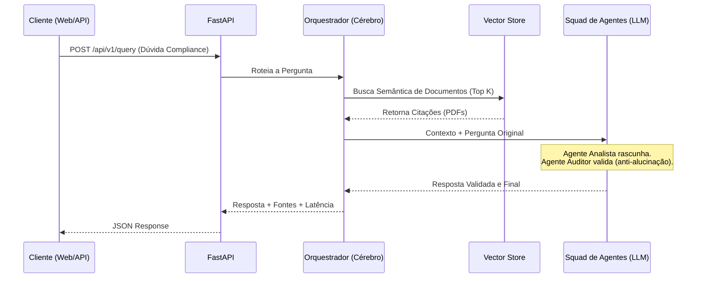

# 🏛️ BACEN Compliance RAG - Multi-Agent AI System


Um sistema avançado de Inteligência Artificial para atuar como **Auditor e Analista de Compliance** com base em normativos do Banco Central do Brasil (BACEN). Projetado com foco em **Clean Code, Arquitetura Hexagonal e MLOps**, este projeto serve como prova de conceito.

---

## 🧠 Arquitetura do Sistema

O projeto foi construído seguindo os princípios da **Arquitetura Hexagonal** (Ports & Adapters), garantindo que a regra de negócios fique totalmente isolada das tecnologias externas.

### Fluxo de Execução (RAG)



* **Ingestão e Vetorização (ETL):** `LlamaIndex` + `HuggingFace (all-MiniLM-L6-v2)`. Embeddings gerados localmente, sem custos de API.
* **Banco de Dados Vetorial:** `ChromaDB` - Banco nativo otimizado para recuperação rápida.
* **Orquestração e Memória:** `LangGraph`, atuando como o cérebro que roteia a query, busca no ChromaDB e chama o Squad de Agentes.
* **Squad Multi-Agente (CrewAI):** Desenvolvido utilizando `CrewAI` (Agente Analista + Agente Auditor de Compliance) para garantir respostas 100% ancoradas na lei (anti-alucinação) e autonomia de delegação.
* **Camada de Apresentação:** `FastAPI` (REST JSON) e uma elegante interface Web UI nativa com Glassmorphism.
* **LLM Provider:** `Groq API` (Alta velocidade, custo zero) via modelo Llama-3.

---

## 📂 Repositório de Conhecimento (RAG Data)

Para que a IA atue estritamente sob as normativas oficiais e evite alucinações (regra fundamental de Compliance), é obrigatório alimentar o "Cérebro" do sistema.

A pasta `data/` na raiz do projeto atua como o seu repositório de conhecimento (*Knowledge Base*).

**Onde encontrar os PDFs oficiais do BACEN?**
- **Busca de Normas (Principal):** [Sistema de Busca de Normas](https://www.bcb.gov.br/estabilidadefinanceira/buscanormas) (Resoluções e Circulares).
- **Regulamento do Pix:** [Portal do Pix no BCB](https://www.bcb.gov.br/estabilidadefinanceira/pix) (Manuais de SLA e MED).
- **Open Finance:** [Governança Open Finance](https://www.bcb.gov.br/estabilidadefinanceira/openfinance).

*Dica:* Para agilizar seus testes, você pode rodar o script `./scripts/fetch_bacen_pdfs.sh` para baixar automaticamente alguns manuais de demonstração.

**O que fazer:**
1. Rode o script de automação: `./scripts/fetch_bacen_pdfs.sh` (ou cole seus próprios PDFs baixados na pasta `data/`).
2. Rode o pipeline de Ingestão de Dados (ETL) utilizando `./scripts/ingest.sh`.

O sistema irá automaticamente extrair o texto dos PDFs, particioná-los (chunking), transformá-los em coordenadas matemáticas (embeddings) e persistir o conhecimento no banco **ChromaDB**. Quando o usuário fizer uma pergunta, o sistema buscará exatamente o parágrafo da lei que responde a dúvida e injetará no contexto da IA.

---

## 🚀 Como Executar Localmente

### Pré-requisitos

* Ter o [uv](https://github.com/astral-sh/uv) instalado.
* Obter uma chave gratuita na [Groq Cloud](https://console.groq.com/keys).

### Passo a Passo

1. **Clone e configure o ambiente**
   Copie o arquivo de variáveis de ambiente e insira sua chave da Groq:

   ```bash
   cp .env.example .env
   ```

2. **Ingestão de Dados (Criação do Banco Vetorial ChromaDB)**
   Popule o banco de dados lendo o Mock do BACEN (Pix):

   ```bash
   ./scripts/ingest.sh
   ```

   *(Ou: `uv run python -m src.infrastructure.parser.pdf_ingestor`)*

3. **Suba o Servidor FastAPI e a Interface Web**

   ```bash
   ./scripts/start.sh
   ```

   *(Ou: `uv run uvicorn src.presentation.api.main:app --reload`)*

4. **Teste a Interface**
   Abra seu navegador em **[http://localhost:8000/](http://localhost:8000/)** para acessar a elegante UI do Chat.
   Ou acesse **[http://localhost:8000/docs](http://localhost:8000/docs)** para o painel de desenvolvedor Swagger.
   Para visualizar a documentação alternativa da API, acesse **[http://localhost:8000/redoc](http://localhost:8000/redoc)** (ReDoc).

### Exemplo de Uso via API

Caso queira testar a integração do RAG programaticamente, após ligar o servidor (`./scripts/start.sh`), basta executar:

```bash
curl -X POST http://localhost:8000/api/v1/query \
     -H "Content-Type: application/json" \
     -d '{"query": "Qual é o prazo máximo para a devolução do Pix via MED?"}'
```

---

## 🐳 Como Executar via Docker (Day-2 Ops)

O projeto está pronto para Cloud (ex: Google Cloud Run). Para subir localmente via contêineres:

```bash
make docker-up
```

*(Ou: `docker-compose up --build`)*

---

## ✅ Qualidade e Testes (100% de Cobertura)

O projeto contém uma suíte de testes unitários super robusta (`pytest`), validando as regras de negócio, a infraestrutura (Mocks do VectorStore e LLM), orquestração (LangGraph) e endpoints (FastAPI). **A cobertura de código (Coverage) é de 100%**.

Para rodar os testes e gerar o relatório:

```bash
./scripts/test.sh
# Ou para relatório detalhado: ./scripts/coverage.sh
```
