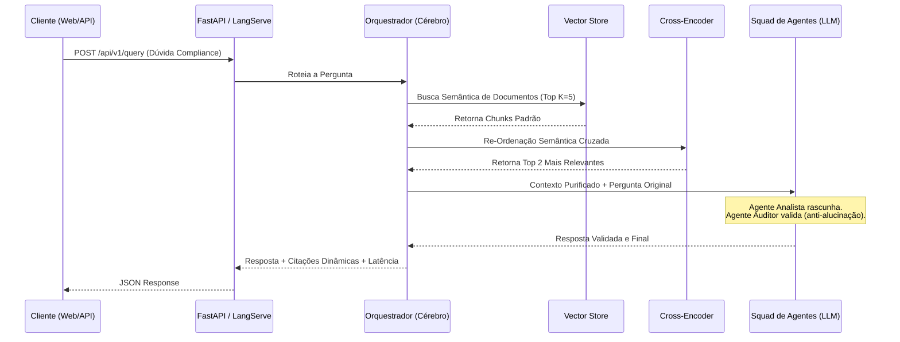

# 🏛️ BACEN Compliance RAG - Multi-Agent AI System


Um sistema avançado de Inteligência Artificial para atuar como **Auditor e Analista de Compliance** com base em normativos do Banco Central do Brasil (BACEN). Projetado com foco em **Clean Code, Arquitetura Hexagonal, MLOps e Observabilidade**, este projeto serve como prova de conceito para desafios avançados de IA.

---

## 🧠 Arquitetura do Sistema

O projeto foi construído seguindo os princípios da **Arquitetura Hexagonal** (Ports & Adapters), garantindo que a regra de negócios fique totalmente isolada das tecnologias externas.

### Fluxo de Execução (RAG)



* **Ingestão e Vetorização (ETL):** `LlamaIndex` + `HuggingFace (all-MiniLM-L6-v2)`. Embeddings gerados localmente, sem custos de API.
* **Banco de Dados Vetorial:** `ChromaDB` - Banco nativo otimizado para recuperação rápida.
* **Re-Ranking Híbrido:** `sentence-transformers` utilizando o Cross-Encoder `ms-marco-MiniLM-L-6-v2` para maximizar a assertividade dos fragmentos de lei passados à IA.
* **Orquestração e Memória:** `LangGraph`, atuando como o cérebro que roteia a query, busca no ChromaDB e chama o Squad de Agentes.
* **Squad Multi-Agente (CrewAI):** Desenvolvido utilizando `CrewAI` (Agente Analista + Agente Auditor de Compliance) para garantir respostas 100% ancoradas na lei (anti-alucinação) e autonomia de delegação.
* **LLM Provider:** Suporte dinâmico para **Groq** (Padrão: `llama-3.3-70b-versatile`) e **Google Gemini** para inferências de altíssimo desempenho e grande janela de contexto. Configurável no arquivo `.env`.
* **Camada de Apresentação:** `FastAPI` (REST JSON, porta 8080), `LangServe` (rotas autogeradas) e `Streamlit` (porta 8000) para prototipação visual de frontend.
* **Observabilidade:** Instrumentado para `LangFuse` (Tracing avançado) e logs persistidos.

---

## 📂 Repositório de Conhecimento (RAG Data)

Para que a IA atue estritamente sob as normativas oficiais e evite alucinações (regra fundamental de Compliance), é obrigatório alimentar o "Cérebro" do sistema.

A pasta `data/normativas_bacen/` atua como o seu repositório de conhecimento (*Knowledge Base*). Os PDFs oficiais depositados nela compõem o contexto das respostas.

**O que fazer para injetar novos documentos:**
1. Cole seus PDFs baixados na pasta `data/normativas_bacen/`.
2. Rode o pipeline de Ingestão de Dados (ETL) utilizando `./scripts/ingest.sh`.
3. O sistema irá automaticamente extrair o texto dos PDFs, particioná-los, transformá-los em embeddings e persistir o conhecimento no banco **ChromaDB**. 

---

## 🚀 Como Executar Localmente

### Pré-requisitos

* Ter o [uv](https://github.com/astral-sh/uv) instalado (Package manager ultrarrápido).
* Obter uma chave de API gratuita no **[Groq Console](https://console.groq.com/keys)** (recomendado para Llama 3) ou no **[Google AI Studio](https://aistudio.google.com/app/apikey)** (para Gemini).

### Passo a Passo

1. **Clone e configure o ambiente**
   Copie o arquivo de variáveis de ambiente e insira suas chaves (GROQ_API_KEY ou GEMINI_API_KEY):

   ```bash
   cp .env.example .env
   # Edite o arquivo .env
   ```

2. **Ingestão de Dados (Criação do Banco Vetorial ChromaDB)**
   Popule o banco de dados lendo os PDFs da pasta de dados (só é necessário na primeira vez ou quando houver novos documentos):

   ```bash
   ./scripts/ingest.sh
   ```

3. **Iniciando a Aplicação (Backend e Frontend)**
   Diferente de sistemas convencionais, este projeto traz scripts automatizados que gerenciam a infraestrutura, subindo tanto a API (FastAPI) quanto a UI (Streamlit) de forma simultânea via lock de processos (PID):

   ```bash
   ./scripts/start.sh
   ```

4. **Monitorando Logs e Parando os Serviços**
   * Acompanhe a saúde do sistema e logs em tempo real:
     ```bash
     ./scripts/status.sh
     ```
   * Encerre ambos os servidores de forma graciosa e segura:
     ```bash
     ./scripts/stop.sh
     ```

### Links Úteis (Com a aplicação rodando)

* **Interface Streamlit (Chat de Compliance):** [http://localhost:8000](http://localhost:8000)
* **Documentação Swagger / ReDoc:** [http://localhost:8080/docs](http://localhost:8080/docs)
* **LangServe Playground (Debug e Rastreabilidade):** [http://localhost:8080/rag/playground](http://localhost:8080/rag/playground)

### Exemplo de Uso via API (cURL)

Caso queira testar a integração do RAG via terminal ou Postman na API (porta 8080):

```bash
curl -X POST http://localhost:8080/api/v1/query \
     -H "Content-Type: application/json" \
     -d '{"query": "Qual é o prazo máximo para a devolução do Pix via MED?"}'
```

---

## 🐳 Como Executar via Docker

O projeto está pronto para ambientes de produção (ex: Google Cloud Run, ECS). Para compilar e subir as imagens localmente via contêineres utilizando Docker Compose:

```bash
docker compose up --build -d
```
*(Caso possua o Makefile local configurado, utilize: `make docker-up`)*

---

## ✅ Qualidade e Testes

O projeto contém uma rigorosa suíte de testes automatizados (`pytest`) validando regras de negócio, infraestrutura de adaptadores e orquestração (LangGraph). **A cobertura de código atual (Coverage) é de 100%**.

Para rodar os testes unitários e gerar o relatório de cobertura:

```bash
./scripts/coverage.sh
# ou
./scripts/test.sh
```

**Testes Funcionais (End-to-End):**
Para rodar o teste E2E completo simulando um fluxo ponta-a-ponta que consome as APIs reais de LLM:

```bash
./scripts/e2e_test.sh
```
