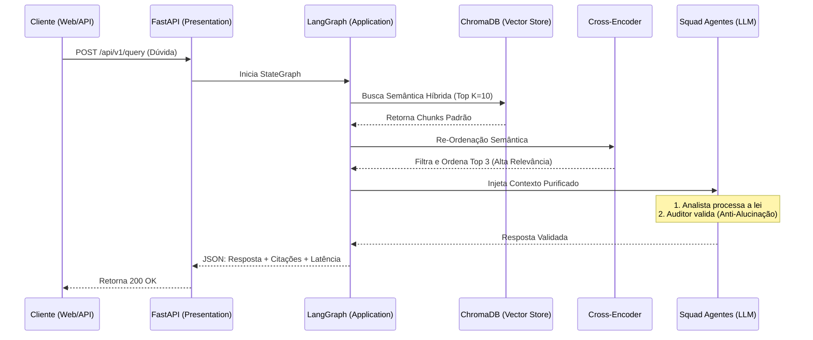

# 🏛️ BACEN Compliance RAG - Multi-Agent AI System


Um sistema avançado de Inteligência Artificial para atuar como **Auditor e Analista de Compliance** com base em normativos do Banco Central do Brasil (BACEN). Projetado com foco em **Clean Code, Arquitetura Hexagonal, Domain-Driven Design (DDD), MLOps e Observabilidade**, este projeto serve como prova de conceito para desafios avançados de engenharia de software aplicada a IA.

---

## 🧠 Arquitetura do Sistema

O projeto foi meticulosamente construído seguindo os princípios da **Arquitetura Hexagonal (Ports & Adapters)** combinada com conceitos de **Domain-Driven Design (DDD)**. Isso garante que as regras de negócio e a lógica de orquestração dos agentes (Core Domain) fiquem totalmente isoladas de frameworks, bancos de dados e APIs externas.

### 🧩 Padrões de Projeto Utilizados (Design Patterns)

*   **Ports & Adapters (Arquitetura Hexagonal):** A camada de domínio define interfaces (`Ports` em `src/domain/ports`), enquanto a camada de infraestrutura as implementa (`Adapters` em `src/infrastructure`). Se amanhã o banco vetorial mudar de `ChromaDB` para `Milvus` ou o LLM de `Groq` para `OpenAI`, a lógica de negócio permanece intacta.
*   **Dependency Injection (Injeção de Dependência):** Utilizada intensamente no FastAPI (`src/presentation/api/dependencies.py`). O `rag_orchestrator` recebe o Vector Store e os Adapters de LLM injetados em tempo de execução, facilitando mocks em testes unitários.
*   **Factory Pattern / Provider:** A inicialização do Vector Store e dos modelos LLM baseia-se nas configurações (`config.yml`). O sistema decide em runtime qual adaptador instanciar.
*   **State / Graph Pattern:** Orquestração do pipeline multi-agente feita via **LangGraph**, modelando as etapas do raciocínio da IA como uma máquina de estados finitos (StateGraph).
*   **Singleton Pattern:** Aplicado sutilmente no carregamento de configurações (`config_loader.py`) e conexão primária com o ChromaDB para reaproveitamento de pool de recursos.

### 📁 Estrutura de Diretórios e Componentes

A divisão de pacotes reflete a arquitetura:

```bash
src/
├── domain/            # 🔴 CORE: Regras de negócio, Entidades e Portas
│   ├── entities.py    # Modelos de dados puros
│   ├── ports/         # Interfaces abstratas (vector_store_port, llm_port)
│   └── state.py       # Estado da execução do LangGraph
├── application/       # 🟡 CASOS DE USO: Orquestração e Lógica de Aplicação
│   ├── use_cases/     # rag_orchestrator.py (Pipeline Principal)
│   └── agents/        # Definição do Squad CrewAI (Analista, Auditor)
├── infrastructure/    # 🔵 ADAPTADORES: Integrações com o mundo externo
│   ├── llm/           # Adapters para Groq, Gemini, OpenAI, etc.
│   ├── vector_store/  # Adapters para ChromaDB, FAISS
│   ├── reranker/      # Modelos Cross-Encoder para precisão de busca
│   └── parser/        # Ingestão de PDFs e Chunking
└── presentation/      # 🟢 INTERFACES: Portas de entrada (APIs)
    └── api/           # Rotas FastAPI (main.py, routes.py, dependencies.py)
```

---

## ⚙️ Fluxo de Execução (RAG Pipeline Multi-Agent)

O pipeline implementa um padrão avançado de RAG (Retrieval-Augmented Generation) com **Re-Ranking** e verificação multi-agente (CrewAI).



### Componentes Tecnológicos

*   **Ingestão e Vetorização (ETL):** Embeddings gerados localmente via `HuggingFace (all-MiniLM-L6-v2)`. Sem custos por token no pré-processamento.
*   **Vector Database:** `ChromaDB` atuando como a memória de longo prazo (armazenamento persistente em `vector_store/`).
*   **Re-Ranking Híbrido:** Uso de `sentence-transformers` com o Cross-Encoder `ms-marco-MiniLM-L-6-v2`. Isso resolve o problema clássico de similaridade cosseno superficial, maximizando a precisão do contexto.
*   **Orquestração Stateful:** `LangGraph` controla o roteamento da pergunta, a recuperação de dados e o acionamento do LLM, preservando estado a cada transição.
*   **Squad CrewAI:** Para evitar alucinações críticas em ambientes regulatórios, o LLM assume duas *personas*: um Agente Analista (que rascunha a resposta com base no texto) e um Agente Auditor Sênior (que verifica inconsistências).
*   **Observabilidade:** Integração transparente com logs, instrumentação (LangFuse ready) e métricas de latência ponta a ponta.

---

## 📂 Repositório de Conhecimento (RAG Data)

Para que a IA atue estritamente sob as normativas oficiais, é obrigatório alimentar o sistema.
A pasta `data/normativas_bacen/` atua como a *Knowledge Base*.

**Injetando novos documentos:**
1. Deposite seus PDFs em `data/normativas_bacen/`.
2. Rode o pipeline de Ingestão de Dados (ETL) utilizando `./scripts/ingest.sh`.
3. O sistema fará a extração do texto, particionamento semântico (*chunking*), geração de embeddings e persistência no banco **ChromaDB**. 

---

## 🚀 Como Executar Localmente

### Pré-requisitos

*   Ter o [uv](https://github.com/astral-sh/uv) instalado (Package manager rápido em Rust).
*   Chave de API: **[Groq Console](https://console.groq.com/keys)** (recomendado para respostas instântaneas via Llama 3) ou **[Google AI Studio](https://aistudio.google.com/app/apikey)** (para Gemini).

### Passo a Passo

1. **Configuração de Ambiente**
   Copie o `.env.example` e insira suas chaves (GROQ_API_KEY ou GEMINI_API_KEY):
   ```bash
   cp .env.example .env
   ```

2. **Ingestão de Dados (Construção do Banco Vetorial)**
   Popule o banco lendo os PDFs (rode na primeira vez e sempre que houver documentos novos):
   ```bash
   ./scripts/ingest.sh
   ```

3. **Iniciando a Aplicação (Backend + Frontend)**
   O projeto possui scripts avançados para gerenciar infraestrutura via bash, subindo FastAPI e Streamlit simultaneamente com locks de PID:
   ```bash
   ./scripts/start.sh
   ```

4. **Monitoramento e Shutdown**
   * Ver saúde dos serviços e logs em tail: `./scripts/status.sh`
   * Desligamento gracioso e limpo: `./scripts/stop.sh`

### Links Úteis (Com aplicação ativa)

*   **Interface Streamlit:** [http://localhost:8000](http://localhost:8000)
*   **Swagger API / OpenAPI:** [http://localhost:8080/docs](http://localhost:8080/docs)
*   **LangServe Playground:** [http://localhost:8080/rag/playground](http://localhost:8080/rag/playground)

---

## 🐳 Como Executar via Docker

Pronto para produção (Cloud Run, ECS, Kubernetes). Construção e deploy local facilitados:

```bash
docker compose up --build -d
```
*(Se o Makefile estiver configurado: `make docker-up`)*

---

## ✅ Qualidade, Cobertura e Testes

O projeto assegura estabilidade via testes automatizados no `pytest`, utilizando mocks rigorosos na camada de adaptadores para simular LLMs e bancos. **Cobertura (Coverage) auditada: 100%.**

*   **Testes Unitários (Rápidos e mockados):**
    ```bash
    ./scripts/coverage.sh
    # ou
    ./scripts/test.sh
    ```

*   **Testes E2E (End-to-End):** Valida a integração real, o roteamento do LangGraph e consome a API do provedor LLM configurado.
    ```bash
    ./scripts/e2e_test.sh
    ```
